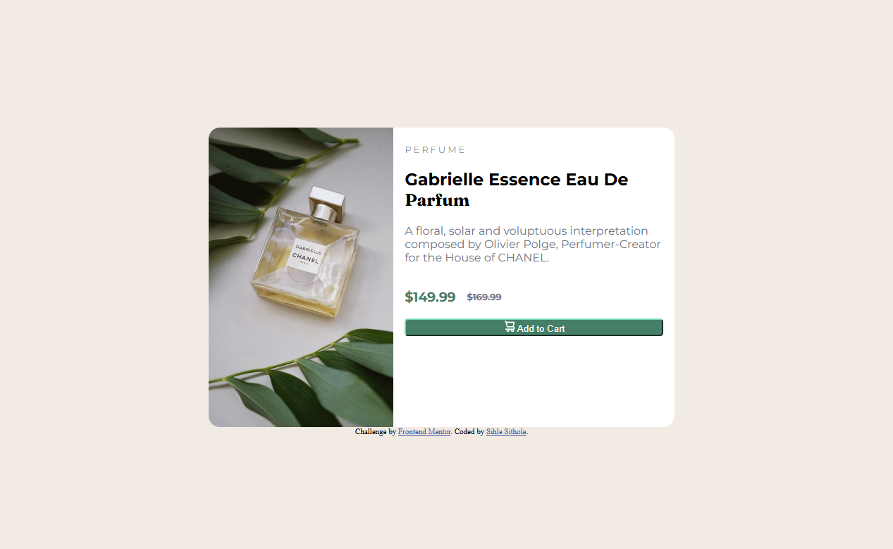

## Table of contents

- [Overview](#overview)
  - [The challenge](#the-challenge)
  - [Screenshot](#screenshot)
  - [Links](#links)
- [My process](#my-process)
  - [Built with](#built-with)
  - [What I learned](#what-i-learned)
  - [Continued development](#continued-development)
  - [Useful resources](#useful-resources)

## Overview

### The challenge

Users should be able to:

- View the optimal layout depending on their device's screen size
- See hover and focus states for interactive elements

### Screenshot

### Links

- Solution URL: [Github Link](https://github.com/Sihle97/product-preview-card)
- Live Site URL: [Live Site](https://Sihle97.github.io/product-preview-card)

## My process

### Built with

- Semantic HTML5 markup
- CSS custom properties
- Flexbox
- Mobile-first workflow

### What I learned

This section taught a lot about responsive page design and mobile first development approach when creating a page. One of the various concepts that are not fital to me when working with images is object fit which is solely responsible for how an image behaves within it's container. The other important concept was box-size which was also vital for completing this task an ensuring that the images uses were never stretched out, block size is more responsible for the container itself rather than the contents within it(important to note that it's not just exclusively for images but can be used for other content forms as well). The overflow property coupled with object fit help maintain a clean image look by not stretching out the content and cropping it out if necessary just to maintain the general aesthetic.

### Continued development

This has been my first responsive page task which is obviously not perfect yet but I intend on making the transition is resposiveess a bit more smoother(basically more natural looking).

### Useful resources

- [Responsilve Images](https://web.dev/learn/design/responsive-images) - This helped with detailing various aspects with images and making them responsive in a page.
